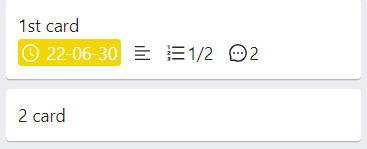

# TrelloLike

## 技术栈
React + TypeScript + Recoil + Vite

## 项目目录
- models
    全局状态(trello状态、弹窗状态)
- pages
    项目页面
    AddCard 增加卡片
    AddList 增加列表
    Card 卡片
    CardList 列表
    Modal 弹窗
        - Activity 活动
        - CheckList 清单
        - Description 描述
        - Header 标题、日期

## 界面和功能展示

展示列表与卡片，可对列表与卡片进行拖拽排序，拖拽功能通过react-beautiful-dnd完成

列表右上方按钮可删除该列表

点击卡片弹窗显示该卡片的详情信息

卡片具有相关属性时显示对应缩略信息
- 日期为完成状态时显示绿色，否则根据卡片的日期时间与当前时间比较，显示黄色或红色
- 描述
- 卡片清单进度，完成时为绿色
- 评论数
