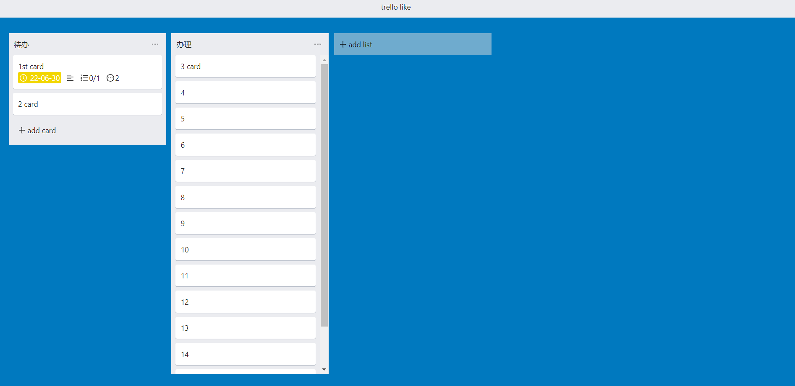
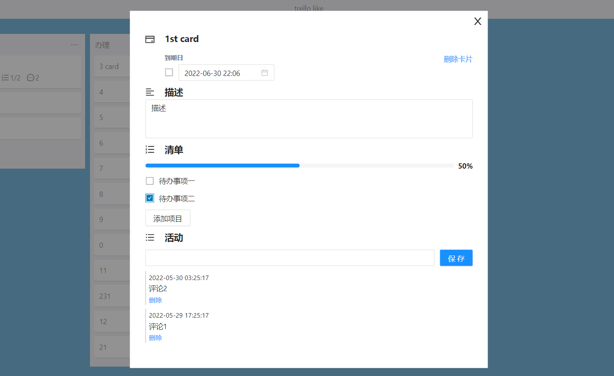

# TrelloLike

## 技术栈
React + TypeScript + Vite

## 界面和功能展示

展示列表与卡片，可对列表与卡片进行拖拽排序，拖拽功能通过react-beautiful-dnd完成

列表右上方按钮可删除该列表

点击卡片弹窗显示该卡片的详情信息

卡片具有相关属性时显示对应缩略信息
- 日期为完成状态时显示绿色，否则根据卡片的日期时间与当前时间比较，显示黄色或红色
- 描述
- 卡片清单进度，完成时为绿色
- 评论数
